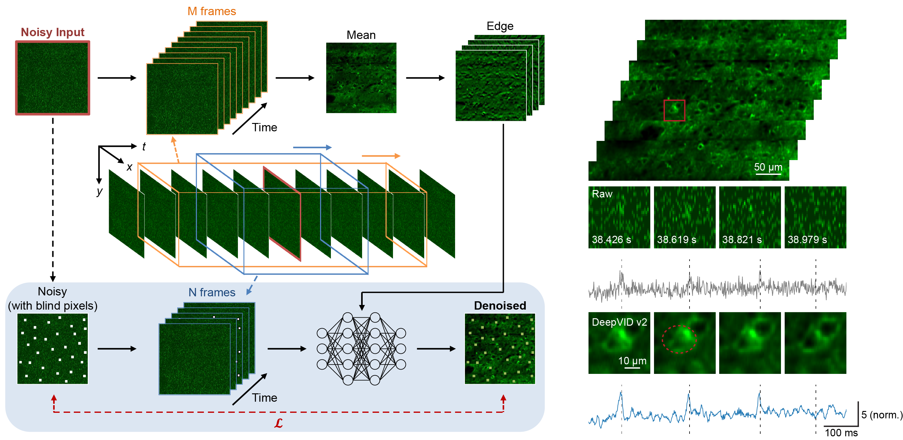

# DeepVID v2: Self-Supervised Denoising with Decoupled Spatiotemporal Enhancement for Low-Photon Voltage Imaging



This repository is the PyTorch implementation of DeepVID v2, as presented in the following preprint:

Liu, C., Lu, J., Wu, Y., Ye, X., Ahrens, A. M., Platisa, J., ... & Tian, L. (2024). DeepVID v2: Self-Supervised Denoising with Decoupled Spatiotemporal Enhancement for Low-Photon Voltage Imaging. bioRxiv, 2024-05.

https://www.biorxiv.org/content/10.1101/2024.05.16.594448

## Requirements

**environment.yaml** lists dependencies for the repository. 

There is no specific requirement on the version of packages. This repository is tested on the environment:

- Linux (AlmaLinux 8)
- Python 3.8
- PyTorch 1.10.2
- CUDA 11.3

## Installation

1. Clone the repository and navigate to the folder

```bash
$ git clone https://github.com/bu-cisl/DeepVIDv2.git
$ cd DeepVIDv2
```

2. Create a virtual environment with conda, and install PyTorch and other dependencies.

```bash
$ conda env create -f environment.yml
$ conda activate DeepVIDv2
$ conda install pytorch torchvision torchaudio pytorch-cuda=11.8 -c pytorch -c nvidia
```

3. Delete placeholder.txt in datasets and results folder

```bash
$ rm datasets/placeholder.txt
$ rm results/placeholder.txt
```

## Training

1. Place noisy images in datasets folder. Each image should be a tif file in shape T x H x W. 

2. Training with DeepVID v2.

```bash
$ python -m deepvidv2 train [--noisy NOISY_DATA_PATHS] [-n INPUT_PRE_POST_FRAME] [-m EDGE_PRE_POST_FRAME]
```

 - The default option will train with images in datasets folder, using 7 frames as input frames (N) and all available frames to extract edge information (M). 

```bash
$ python -m deepvidv2 train
```

 - For more options, please refer to the manual:

```bash
$ python -m deepvidv2 train --help
```

## Inference

1. Inference with DeepVID v2.

```bash
$ python -m deepvidv2 inference [--noisy NOISY_DATA_PATHS] [--model MODEL_STRING]
```

 - MODEL_STRING is the folder name of trained models in results folder, in a format of YYMMDD-HHMMSS

 - The default option will inference all images in datasets folder. 

```bash
$ python -m deepvidv2 inference [--model MODEL_STRING]
```

 - For more options, please refer to the manual:

```bash
$ python -m deepvidv2 inference --help
```

## Contributors

For any questions or requests, please contact the following author:

 - Chang Liu ( cl6 [at] bu [dot] edu )